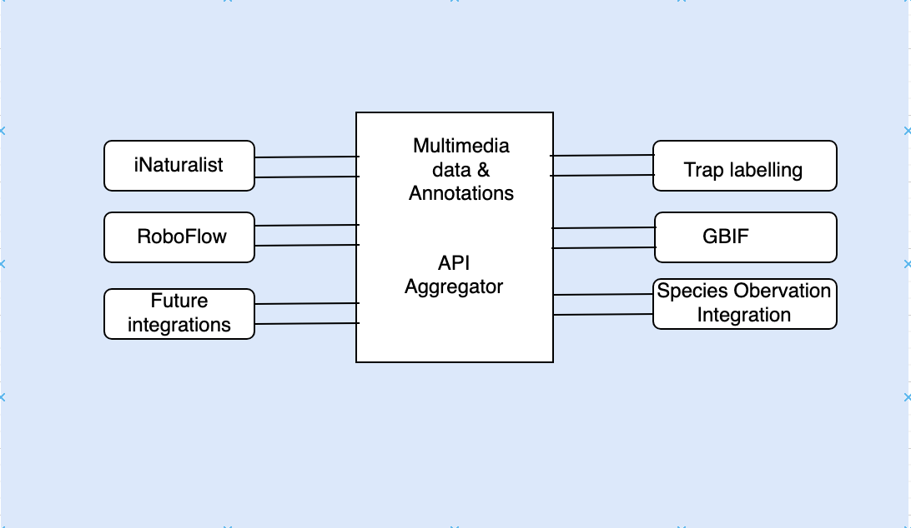

# Integrations Module: Bridging Business with Partners and Vendors 

The Integrations module serves as a crucial bridge connecting the Wildlife AI business with a diverse spectrum of services and platforms. It establishes connections with essential tools such as camera trap labeling solutions like Wildlife Insights, facilitates collaboration with experts through platforms like iNaturalist, aids in training edge model services like TensorFlow Lite, and enables the sharing of data with the broader community via platforms like GBIF.

The architectural foundation of this module is deeply rooted in the concept of a micro-kernel, which provides the necessary flexibility and extensibility to support a wide array of integrations. By isolating distinct integration logic and the specific data formats required to process business requests, it streamlines interactions with the extensive ecosystem of services. This approach ensures that the Wildlife AI business remains agile and well-prepared to engage with an ever-evolving landscape of services and platforms.

## Components

### Plugins

Each integration with partners and vendors is encapsulated within an individual plugin, with each plugin exposing its distinctive set of APIs. Internally, these plugins are configurable, enabling them to efficiently communicate with their respective partner APIs and function as adapters for data manipulation when exchanging information between image data and partner APIs. The module is constructed to smoothly accommodate future integrations, facilitating the incorporation of new plugins into the ecosystem.

### Core System
Core system has two responsbilities

#### 1. UI Component Hosting

Integrations module acts as a framework for hosting various user interface components. These components play a pivotal role in enabling users to view and interact with diverse datasets originating from extensive network of integrations. The UI Component plays a central role in this process by interfacing with various APIs provided by own modules. It facilitates the retrieval of images from internal API and uploading of image or video data to partners, such as Wildlife Insights, iNaturalist, or edge model services like TensorFlow Lite and GBIF. This hosting functionality greatly enhances the overall user experience, allowing for the seamless management of data from multiple sources.

#### 2. API Aggregator

The Integrations module also takes on the responsibility of aggregating all APIs into a unified interface, enabling UI components to communicate and display data in a consistent manner. This aggregation ensures that data is presented to users as designed, allowing them to view and interact with it seamlessly. This centralization of APIs simplifies the complexity of identifying plugins and handling data from diverse sources, streamlining the user experience and making it more efficient.

## Related ADRs
[ADR 005](../ADRs/ADR005%20-%20Integrations.md)

## Summary
In summary, the Integrations module is the backbone of Wildlife AI's integration strategy, ensuring that Wildlife AI can effectively collaborate with partners and vendors, both now and in the future. Its micro-kernel architecture and the dual roles of API aggregation and UI component hosting make it a crucial part of the system, enhancing Wildlife AI's ability to harness the power of external services while maintaining a cohesive and efficient user experience.