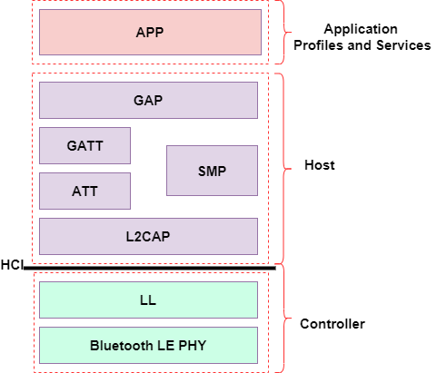
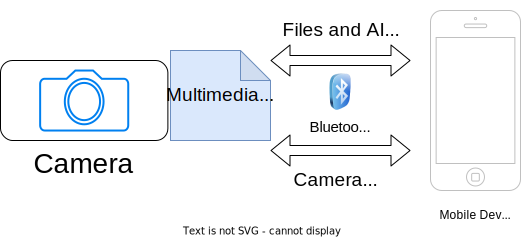

# Multimedia Domain: Proving Multimedia services to Mobila App 

The Multimedia capability enables the Wildlife AI Mobile App to receive images from the Wildlife AI cameras. The following features are provided by this capability:
- Store images and videos with their metadata in the Mobile App storage.

This design removes the need of central storage and allows each camera operator to store as little or as many images/videos as needed and as possible on their devices.

[**LINK TO DOMAIN DIAGRAM**]

## Components
The Bluetooth spec already has a well defined protocol stack for initiating communications and transfer with controllers and peripherals

Bluetooth has a multilevel stack from the physical layer all the way up to the application layer. The topmost part of this is the Application Profile, this defines common, high level operations for popular devices.

### Plugins
- We recommend that W.ai reuse the file transfer capabilities already present in the Bluetooth spec
- According to the current images on iNaturalist, images are only 640x480 and ~15K. Easily handlible by Bluetooth speeds.

### Core System
The core system to retreive the images is the pre-existing Bluetooth stack.
- The there is already a protocol for discovery and pairing, for the initial connection
- There is already an Object Transfer Application profile for moving data to and from the camera

#### 1. Bluetooth service
- The topmost level of the Bluetooth stack is the Application Profile. This contains a Profile for the Object Transfer Service, this will allow us to query and retreive blobs (in our case, files) from the camera and onto the mobile device.
- This profile also allows deletion of the blobs
- The General Attributes Profile provides the Mobile app the ability to read and write "slots" on the Camera that will control settings such as aperture, color balance, flash, sensitivity to motion etc., anything the cameras firmaware exposes to the outside world

#### 2. Camera Multimedia features
Most of the camera side operations are a black box to us.
- The camera will watch for motion and then snap imagaes of whatever the camera is pointing to.
- The AI model on the camera will attempt to use its current model to identify whatever is in the picture and label it with a bounding box and any other metadata about the image (lat lon, temperature, humidity, timestamp etc...)
- The camera save these images locally until a user transfers them to a device via the Mobile App

## Related ADRs

[ADR 003](../ADRs/ADR003-Processing%20with%203rd%20Parties%20and%20Edge%20Computing)

## Summary
In summary, the Multimedia domain is the main image system for the Wildlife AI's Mobile App, ensuring that users can store images and videos for processing and cataloging.